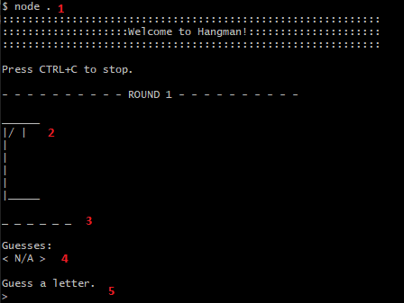

#  Hangman

### ✍️ Description
> CLI-based game that runs Hangman locally in the console.
The game is run using a provided array of potential words (>900) and features visual indicators to the user to follow along.

### 🚀 Usage
Clone the repository and run the following command at the root of the project:

`node .`

This begins the game through the active running command-line.

### 🎮 Gameplay
Once the game begins running, you should be presented with the following interface:

- **(1)** - Represents the command required to initialize the game
- **(2)** - Represents the 'gallows' (visual representation of the remaining guesses the user has made incorrectly)
- **(3)** - Represents the 'outline' of the word (visual representation of the progress the user has made in guessing and uncovering letters within the word)
- **(4)** - Represents the 'guess bank' (visual representation of the collection of letters the user has already guessed thus far)
- **(5)** - Represents the user input field (visual representation of where the game prompts the user to input a guess)

### ⚖️ Game Behavior & Rules

- The goal of the game is for the user to incrementally guess the word selected, letter by letter, until the word is fully revealed
- The user is afforded 6 incorrect guesses before the game terminates (that is, the user is allowed 5 incorrect guesses before the 6th and final incorrect attempt ends the game)
- The user must input a single alphabetical character when prompted to make a guess
- The user may input a guess that is case-insensitive (meaning the console will treat `a` and `A` as the same guess)
- The user is not penalized for guessing a letter multiple times (the game will prompt the user to guess again)
- The user is not penalized for attempting an 'empty' guess or attempting a guess without inputting a letter (the game will prompt the user to guess again)
- The game end conditions are met when the user exhausts all guess attempts (resulting in a loss) or the user correctly guesses all letters within the word before exhausting all guess attempts (resulting in a win)
- The game prompts the user when the game end conditions are met if they would like to begin a new game

### 💡 Concepts
- Encapsulation and Closure (through IIFE/module pattern)
- ES6 syntax (arrow functions, block scope variable declaration, template literals)
- Higher order functions (through array methods `forEach()` and `sort()`)
- Basic input validation (through `readline-sync` various `options` functionality)